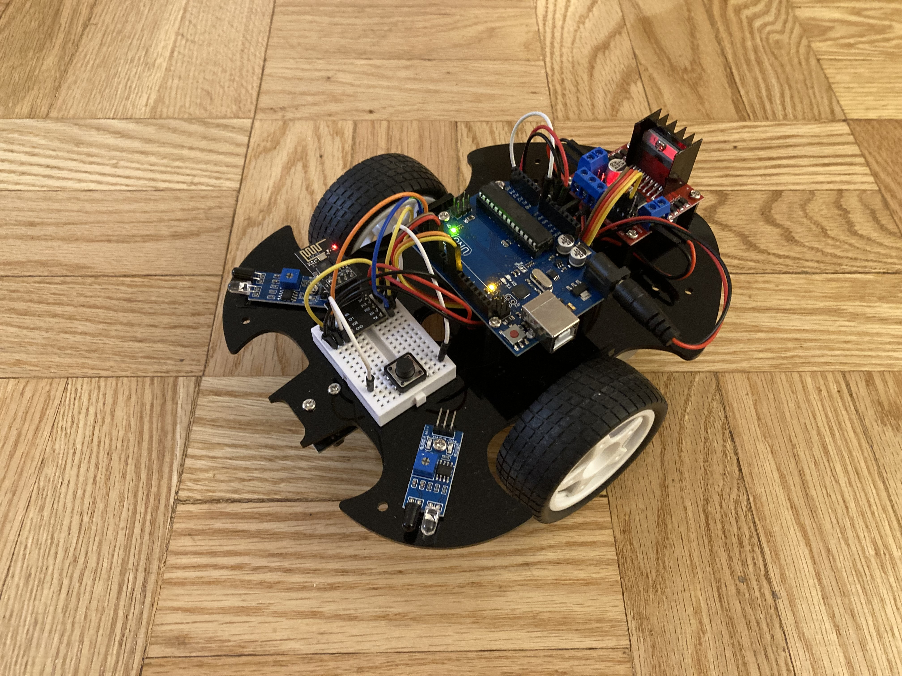

# IoT Wireless Car
The IoT Wireless Car is a small three-wheeled robot which can be controlled from anywhere in the world with internet access! It uses an Arduino and full-bridge to control it's drive motors, and an ESP8266 to connect to a local wireless network. The Arduino and ESP communicate with each other over a two-wire serial interface, allowing for bi-directional exchange between the vehicle and it's operator over the internet. The device uses Blynk's IoT platform for a streamlined mobile user interface.

| **Engineer** | **School** | **Area of Interest** | **Grade** |
|:--:|:--:|:--:|:--:|
| Evan M. | The Cooper Union | Electrical Engineering | Incoming Senior

# Potential student challenges
- Orientation of the acrylic piece and wiring can be confusing
- Undertsanding of source code, particularly for IoT projects involving the ESP8266
- IoT projects utilizing the Blynk platform are not simple to set up. But there is good documentation, and it worked for me on my network.
- Troubleshooting with limited test equipment

# In-kit modifications
### Battery level indicator
- Resistive voltage divider between `Vin` and ground into an analog input to map the approx. 6-9v range of the battery down to the ADC range of the Arduino
- Alert LED or show percentage on character LCD
- Good application of V=IR

### Wireless control with obstacle detection override
- In normal operation, wireless control by the operator
- When obstacle detected in path, override and only allow backward input from operator

### 2-D sonar
- Attach ultrasonic sensor to servo, to create a 2-D map of potential obstacles
- Could expand to room-mapping (difficult without encoders on the wheels)
- Might be more interesting with RPi for visualization

# Out-of-kit modifications
### Sensor mapping
- Have the robot move autonomously in a grid pattern
- Sample some sensor data at regular intervals, and save (maybe to SD card?)
- Access the data on computer and visualize as a heatmap in Processing or Python or something
- Picking a sensor is difficult: what is not uniformly distributed in a small space in a home? Maybe light?

### True RC
- Alternate radio for TX/RX
- More reliable and responsive than IR or IoT

### Dangerous gas sensor
- Sparkfun has many different gas sensors
- Send an alert back to the operator wirelessly if levels are dangerous
- Con: not testable (hopefully)
